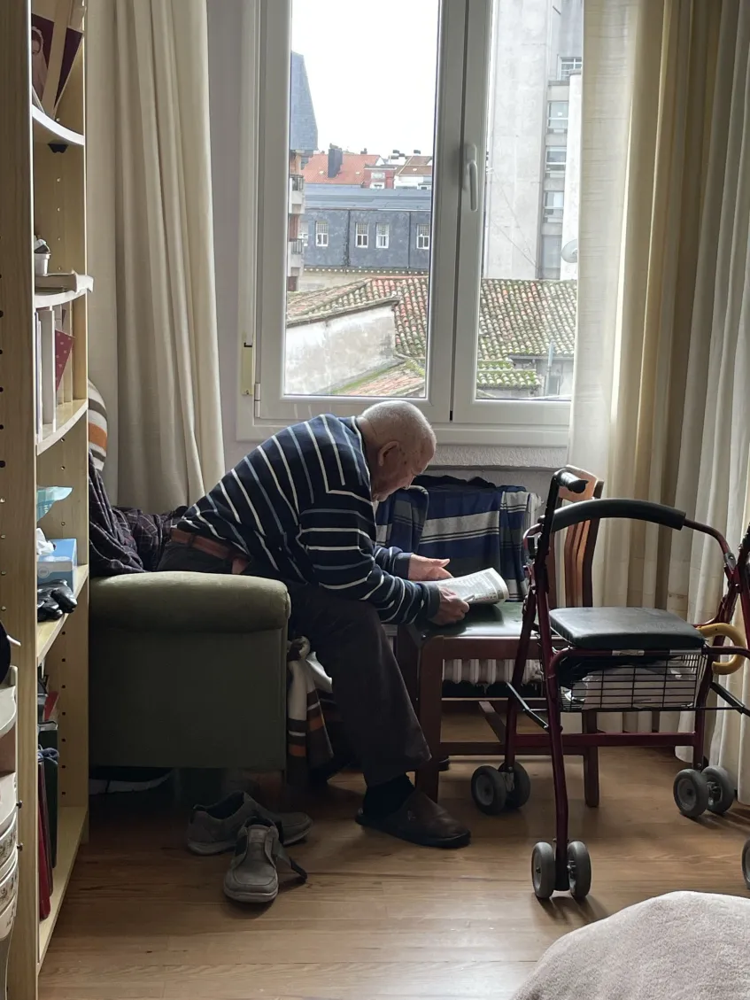

# Carmelo's Canine

**A robotic service dog for the elderly who live alone.**
A Track 3 — Robotics submission.

> Carmelo is 97 and lives alone. **Carmelo's Canine** is a quadruped service robot that walks his home, picks up what he drops, and delivers his medications — reducing falls and keeping him out of the nursing home. When something feels wrong, his grandson can teleop in remotely from three states away.



> *This is Carmelo. He's 97 and lives alone in his apartment. The walker beside him is the reason we built this.*

---

## Demo

[](https://youtu.be/fOGT5CDUfUE)

**What you're watching:** an operator teleops a Unitree Go2 Air into Carmelo's room. The mounted Seeed reBot arm triggers a recorded skill: it picks up his medicine bottle from the counter and offers it to him.

**What's honest about it:** driving is teleoperated, the pickup is a recorded trajectory replay. The hardware loop closes. The body works. The skill works. **It's a primitive, not a product** — but it's the smallest version of this that's *real*.

[**📊 View the live pitch deck →**](https://alisoncossette.github.io/carmelos-canine/carmelo-deck.html)

---

## Why this matters

| | |
|---|---|
| **88%** | of adults 50–80 want to age in their own home _(AARP)_ |
| **1 in 4** | adults 65+ falls each year _(CDC)_ |
| **$108K** | median annual cost of a U.S. nursing home _(Genworth)_ |
| **56M** | Americans 65+, today |

The gap between *independent* and *facility* is filled with anxious phone calls and adult children guessing whether Grandpa ate today. Embodied AI is the first technology with a real chance of closing it — not by replacing family, but by being a presence in the home that *moves, watches, and helps*.

---

## Architecture

```
┌───────────────────────────────────────────────┐
│   Body — Unitree Go2 Air + Seeed reBot arm    │
│   Quadruped mobility (stairs, halls)          │
│   6+1 DoF arm for pick-and-place ADL tasks    │
└─────────────────┬─────────────────────────────┘
                  │ onboard cameras, IMU, depth
                  ▼
┌───────────────────────────────────────────────┐
│   Edge perception                             │
│   Pose, fall detection, object recognition    │
│   Edge-first; cloud only on novelty/distress  │
└─────────────────┬─────────────────────────────┘
                  │ intent
                  ▼
┌───────────────────────────────────────────────┐
│   Skill layer  [TODAY: TELEOP + REPLAY]       │
│   Operator drives, recorded skill executes.   │
│   Next: schedule / voice / perception         │
│   triggers — same skill, no joystick.         │
└─────────────────┬─────────────────────────────┘
                  │ events, summaries, alerts
                  ▼
┌───────────────────────────────────────────────┐
│   Family loop                                 │
│   Daily summaries, alert escalation,          │
│   "say hi" — robot is the bridge,             │
│   not the replacement.                        │
└───────────────────────────────────────────────┘
```

---

## What we built — the drivers

A consumer-grade ADL robot needs a quadruped *and* an arm *and* a way to teach it new skills. We wrote the glue. All drivers live in [drivers/](drivers/).

### `go2_driver.py` — Unitree Go2 Air locomotion
[drivers/go2_driver.py](drivers/go2_driver.py)
Quadruped control: gait, posture, velocity commands. The body that gets to Carmelo's room.

### `go2_navigation_bridge.py` — Waypoint navigation
[drivers/go2_navigation_bridge.py](drivers/go2_navigation_bridge.py)
Bridges high-level semantic goals to Go2 motion. Where teleop will be replaced by autonomous routing.

### `pipergo2_manipulation_driver.py` — Arm-on-quadruped coordination
[drivers/pipergo2_manipulation_driver.py](drivers/pipergo2_manipulation_driver.py)
Coordinates the manipulator arm with the Go2 base. **One driver, two robots, one motion plan** — this is the non-trivial integration that makes the medicine-bottle pickup work as a single skill rather than two choreographed scripts.

### `rebot_arm_driver.py` — Seeed reBot Arm B601-DM
[drivers/rebot_arm_driver.py](drivers/rebot_arm_driver.py) · [profile](drivers/rebot_arm.md)
Driver for the **Seeed reBot Arm B601-DM** — 6+1 DoF open-source manipulator built on Damiao brushless servos (DM4310 / DM4340P) over CAN. LeRobot / ROS2 / Isaac Sim compatible. This is the **teach-by-demo path** — the same pipeline we'll use to grow the skill library beyond the medicine bottle: hydration handoff, dropped-object retrieval, stillness check, stand-up assist call.

---

## Today vs. Next

| Working today | Building next |
|---|---|
| ✓ Go2 Air locomotion driver | → Schedule trigger ("8am, meds") |
| ✓ Arm-on-quadruped manipulation driver | → Voice trigger ("robot, my pills") |
| ✓ reBot arm + Damiao CAN driver | → Perception trigger (bottle dropped) |
| ✓ Teleop driving + recorded skill replay | → Skill library: hydration, dropped object, stillness check |
| ✓ Medicine-bottle pickup + hand-off | → Family-app summary pipeline |

We'd rather show judges a real robot doing one thing than a slide deck doing twenty.

---

## Where it goes

The same recorded skill, triggered without the operator. Then ten more skills, each one teach-by-demo on the hardware we already wrote drivers for. The drivers are the leverage — every new ADL routine reuses the same Go2 + arm coordination layer.

---

## Judging criteria coverage

| Dimension | Weight | How this submission scores |
|---|---|---|
| **Utility & Impact** | 30% | 56M Americans 65+ today; aging-in-place is the most-wanted, worst-served demographic in tech. Real, large, durable. |
| **Creativity & Innovation** | 30% | Mobile body (quadruped + arm), not a fixed sensor. "Service dog" framing makes the value legible to non-technical stakeholders. Family-loop design instead of chatbot. |
| **Quality & Technical Strength** | 30% | Four working drivers in [drivers/](drivers/), real hardware loop closed end-to-end, honest about scope (teleop + replay) — judges respect this more than overclaim. |
| **Presentation** | 10% | Seven-slide deck with embedded demo video, README with architecture diagram and judging-criteria map. |

---

## Repo layout

```
carmelos-canine/
├── README.md              ← you are here
├── carmelo-deck.html      ← 7-slide pitch (open in browser)
├── drivers/               ← driver contributions
│   ├── go2_driver.py
│   ├── go2_navigation_bridge.py
│   ├── pipergo2_manipulation_driver.py
│   ├── rebot_arm_driver.py
│   └── rebot_arm.md
└── *.jpg                  ← Carmelo + team photos
```

> **Upstream framework:** these drivers are written against the [PhyAgentOS](https://github.com/sysu-hcp-eai/PhyAgentOS) hardware-abstraction layer (`hal.base_driver.BaseDriver`). To run them in a full agent stack, drop them into `PhyAgentOS/hal/drivers/`.

---

## Track

**Track 3 — Robotics**
Embodied AI agents controlling real hardware via natural language; pick-and-place, planners, vision grasping.

Hardware: Unitree Go2 Air · Seeed reBot Arm B601-DM · Damiao DM4310/DM4340P servos · LeRobot

---

## Team


- **Sameer Shah** — Team Leader
- Arjun Kumar
- Abid Ramay
- Alison Cossette
- Nico Musitu
